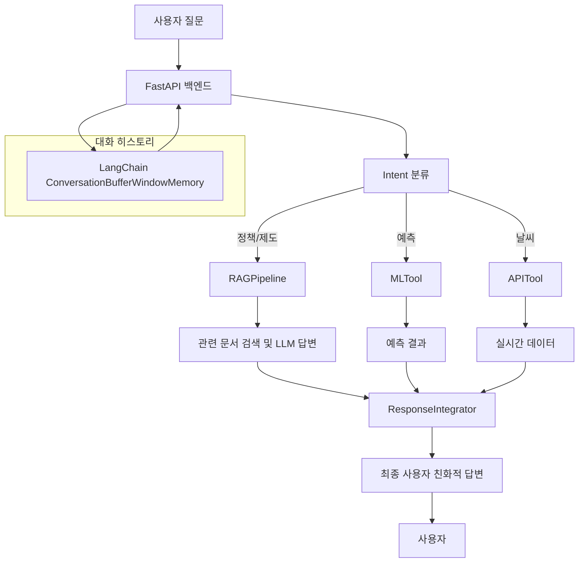

# RAG 챗봇 MVP 구현 요약

## 1. 현재 구현된 기능

- 크롤링 데이터 → 전처리 → 문서화 → 벡터화(OpenAI/HuggingFace) → Chroma 벡터DB 저장
- 문장/단락 단위 + 고정 길이 + 슬라이딩 윈도우 청킹 전략 적용
- RAGPipeline: 관련 문서 검색 및 LLM 컨텍스트 생성, 후처리(중복/불완전 문장/공백 제거)
- 프롬프트 템플릿 구조화 및 친근한 말투 적용
- FastAPI 기반 REST API, 챗봇 에이전트
- Intent 분류 → RAG/ML/API 등 도구 실행 → 결과 통합
- ResponseIntegrator로 사용자 친화적 답변 포맷팅
- 참고문서 url만 제공, url 없으면 생략
- 대화 히스토리 관리(최근 10턴), 시스템 정보 제공
- 데이터 적재, 벡터DB 생성, 쿼리 테스트 자동화(load_data.py)

## 2. 멀티턴 대화 지원 현황

- LangChain의 `ConversationBufferWindowMemory`를 사용하여 최근 10턴의 대화 히스토리 관리
- 챗봇 에이전트(`ChatbotAgent`)에서 사용자/AI 메시지를 메모리에 저장 및 활용
- **현재는 단순한 히스토리 저장만 지원**
  - 이전 대화 맥락을 LLM 프롬프트에 적극적으로 반영하는 구조는 아님
  - 멀티턴 문맥 기반 답변(예: "방금 말한 정책에 대해 더 알려줘")은 추가 구현 필요

## 3. 부족하거나 개선 가능한 점

- 참고문서 url이 없는 경우가 많음 → 크롤러 개선 필요
- 답변의 다양성/자연스러움 → 프롬프트 튜닝, LLM 파라미터 조정
- 멀티턴 대화(문맥 유지) 고도화 → LangChain 메모리, 사용자별 세션 관리 등 확장 필요
- 실시간 데이터/정책 업데이트 → 크롤러 자동화, 주기적 데이터 갱신 파이프라인 구축
- ML 예측/실시간 API 연동 → 발전량 예측, 날씨 등 실제 서비스와 연동
- 프론트엔드 UI/UX → 사용자 피드백 반영, 대화형 UX 고도화

## 4. 다음 단계 제안

1. 데이터 품질 고도화 (url, 출처, 날짜 등 메타데이터 확보)
2. 답변 품질 향상 (프롬프트 예시 추가, 다양한 말투 실험)
3. 대화형 기능 확장 (멀티턴 문맥 반영, Follow-up 질문 등)
4. 실시간/외부 데이터 연동 (정책/뉴스/예측/날씨 등)
5. 운영/모니터링 (로그, 통계, 피드백)
6. 프론트엔드 고도화 (대화형 UI/UX 개선)

---

## 시스템 구조 다이어그램

